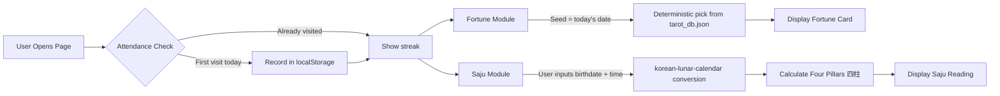

# Daily Fortune — Architecture

> Zero-cost daily fortune / tarot / Saju (사주) web service — fully client-side, no backend.

## System Overview

```
┌──────────────────────────────────────────────────────┐
│                     Browser (Client)                 │
│                                                      │
│  ┌────────────┐  ┌────────────┐  ┌───────────────┐  │
│  │ Attendance │  │  Fortune   │  │  Saju (사주)   │  │
│  │  Module    │  │  Module    │  │   Module       │  │
│  │            │  │            │  │                │  │
│  │ localStorage  │ tarot_db   │  │ korean-lunar   │  │
│  │ read/write │  │ .json      │  │ -calendar lib  │  │
│  └─────┬──────┘  └─────┬──────┘  └──────┬────────┘  │
│        │               │               │             │
│        └───────────┬────┘───────────────┘             │
│                    │                                  │
│             ┌──────┴──────┐                           │
│             │   App Core  │                           │
│             │  (main.js)  │                           │
│             └──────┬──────┘                           │
│                    │                                  │
│             ┌──────┴──────┐                           │
│             │  UI / View  │                           │
│             │ index.html  │                           │
│             │ style.css   │                           │
│             └─────────────┘                           │
└──────────────────────────────────────────────────────┘
         ▲
         │  Static files served via
         │
┌────────┴─────────┐
│    Railway        │
│  (Static Host)   │
│  ← GitHub Repo   │
└──────────────────┘
```

## Domain Map

| Domain | Owns | Key Files |
|--------|------|-----------|
| **Attendance** | Daily check-in tracking, streak counting, calendar UI | `src/attendance.js` |
| **Fortune** | Tarot/fortune-cookie randomizer, card display | `src/fortune.js`, `public/tarot_db.json` |
| **Saju** | Korean four-pillars astrology, lunar date conversion | `src/saju.js` |
| **UI/View** | Layout, animations, theme, responsive design | `index.html`, `src/style.css` |
| **App Core** | Module orchestration, date gating, routing | `src/main.js` |

## Data Flow



## Key Technology Decisions

| Decision | Choice | Rationale |
|----------|--------|-----------|
| Build tool | **Vite** (vanilla JS template) | Fast dev server, tree-shaking, zero-config static output |
| Backend | **None** | $0 cost requirement; all logic is client-side |
| Fortune data | **Static JSON** (`tarot_db.json`) | No API calls, instant load, works offline |
| Lunar calendar | **korean-lunar-calendar** (npm) | KASI-standard, 1000–2050 range, lightweight |
| Persistence | **localStorage** | No auth needed, zero cost, sufficient for attendance |
| Hosting | **Railway** (static) | GitHub-linked auto-deploy, free tier available |
| Randomization | **Date-seeded PRNG** | Same fortune per user per day (deterministic) |

## Dependency Direction

```
Static Data (tarot_db.json)
       ↓
  Domain Modules (attendance.js, fortune.js, saju.js)
       ↓
    App Core (main.js)
       ↓
    View Layer (index.html + style.css)
```

Modules depend **only downward**. No circular dependencies. Each module exposes a single public function.

## Deployment Topology

```
Developer → git push → GitHub Repo → Railway Auto-Deploy → Static CDN
```

- **Build command**: `npm run build` (Vite produces `dist/`)
- **Publish directory**: `dist/`
- **Cost**: $0 (Railway free tier for static sites)
- **Domain**: Railway-provided subdomain (custom domain optional)

## Security & Privacy

- **No user data leaves the browser** — all persistence is localStorage
- **No API keys or secrets** — fully static
- **No cookies / tracking** — privacy-first design
- **CSP headers**: Recommended via Railway config

## File Structure (Target)

```
daily-fortune/
├── public/
│   └── tarot_db.json          ← fortune/tarot card database
├── src/
│   ├── main.js                ← app entry point
│   ├── attendance.js          ← daily check-in logic
│   ├── fortune.js             ← fortune randomizer
│   ├── saju.js                ← saju four-pillars logic
│   └── style.css              ← all styles
├── index.html                 ← single page app shell
├── package.json
├── vite.config.js
├── ARCHITECTURE.md            ← this file
├── WORKFLOW.md
└── .agents/                   ← oh-my-agent skills & workflows
```

<!-- MANUAL: Notes below this line are preserved on regeneration -->
