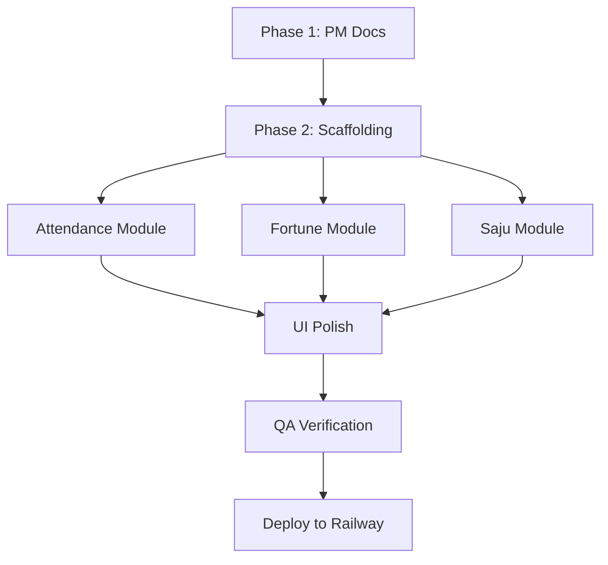

# Daily Fortune — Workflow

> Agent collaboration and development workflow for the daily fortune project.

## Agent Responsibilities

| Agent | Scope | Outputs |
|-------|-------|---------|
| **PM Agent** | Requirements, architecture docs, task decomposition | `ARCHITECTURE.md`, `WORKFLOW.md`, `plan.json` |
| **Frontend Agent** | UI/UX, HTML structure, CSS styling, responsive design | `index.html`, `style.css`, component markup |
| **Backend Agent** | _Not applicable_ (no server) | — |
| **QA Agent** | Cross-browser testing, accessibility, Lighthouse audit | Test reports, bug fixes |
| **DevOps / Infra** | Railway deployment, GitHub CI, static build config | `vite.config.js`, Railway settings |

## Development Phases

### Phase 1: PM Agent — Blueprint ✅
1. Draft `ARCHITECTURE.md` — system topology, tech decisions, data flow
2. Draft `WORKFLOW.md` — agent workflow, development phases
3. User reviews and approves before any code is written

### Phase 2: Frontend Agent — Scaffolding
1. Initialize Vite (`npm create vite@latest ./ -- --template vanilla`)
2. Create project structure (`src/`, `public/`)
3. Create `tarot_db.json` — fortune/tarot card database (78 Major + Minor Arcana)
4. Set up `vite.config.js` for static build output

### Phase 3: Frontend Agent — Feature Implementation
1. **Attendance module** (`src/attendance.js`)
   - Check localStorage for today's date key
   - Record new attendance, calculate streaks
   - Render attendance calendar UI
2. **Fortune module** (`src/fortune.js`)
   - Load `tarot_db.json` at startup
   - Date-seeded PRNG for deterministic daily fortune
   - Card flip animation + fortune text display
3. **Saju module** (`src/saju.js`)
   - Integrate `korean-lunar-calendar` via npm
   - Convert solar → lunar date from user's birthdate
   - Calculate Four Pillars (년주/월주/일주/시주)
   - Display Saju reading with element analysis

### Phase 4: Frontend Agent — UI/UX Polish
1. Design a premium dark-mode UI with glassmorphism
2. Add micro-animations (card flip, streak celebration, tab transitions)
3. Responsive layout for mobile / tablet / desktop
4. Google Fonts (Inter or Noto Sans KR for Korean text)
5. SEO meta tags and semantic HTML

### Phase 5: QA Agent — Verification
1. Cross-browser check (Chrome, Safari, Firefox)
2. Lighthouse audit (Performance, Accessibility, SEO, Best Practices)
3. localStorage edge cases (cleared storage, private browsing)
4. Date boundary testing (timezone handling, midnight rollover)

### Phase 6: Deployment
1. `npm run build` → verify `dist/` output
2. Push to GitHub repository
3. Connect GitHub repo to Railway for auto-deploy
4. Verify live site loads and functions correctly

## Task Dependency Graph

> **Note**: Attendance, Fortune, and Saju modules can be built **in parallel** as they have no cross-dependencies.

## Conventions

- **Branching**: `main` only (single-developer static site)
- **Commits**: Follow [Conventional Commits](https://www.conventionalcommits.org/) (`feat:`, `fix:`, `docs:`, `style:`)
- **No secrets**: Zero API keys or env vars needed
- **Date handling**: All dates use `YYYY-MM-DD` format as localStorage keys
- **Korean text**: Use `lang="ko"` on relevant HTML sections

## Cost Analysis

| Resource | Cost | Notes |
|----------|------|-------|
| Railway static hosting | **$0** | Free tier for static sites |
| GitHub repository | **$0** | Free for public/private repos |
| npm dependencies | **$0** | Open-source packages only |
| API calls | **$0** | No external APIs — fully offline-capable |
| **Total monthly** | **$0** | Zero maintenance cost ✅ |

<!-- MANUAL: Notes below this line are preserved on regeneration -->
